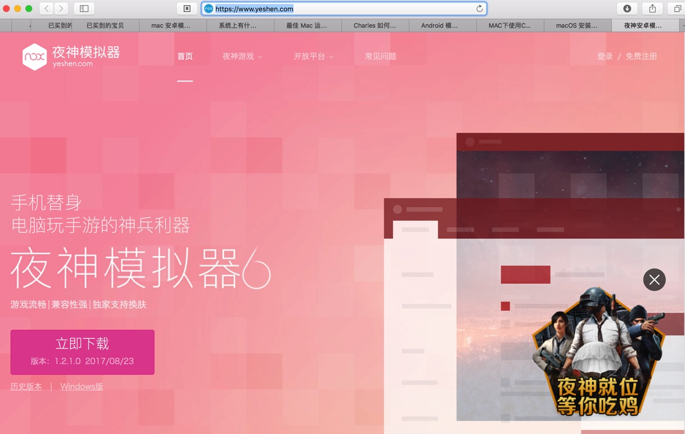
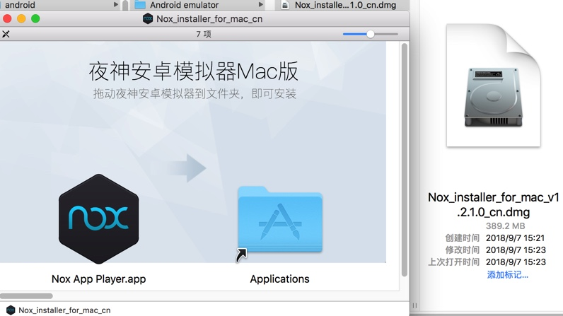
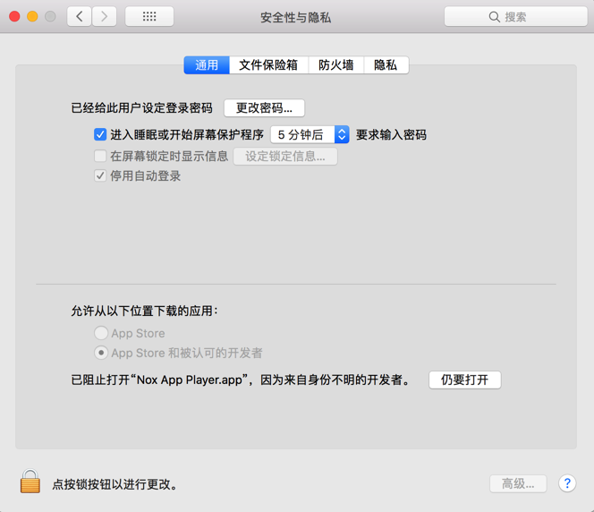
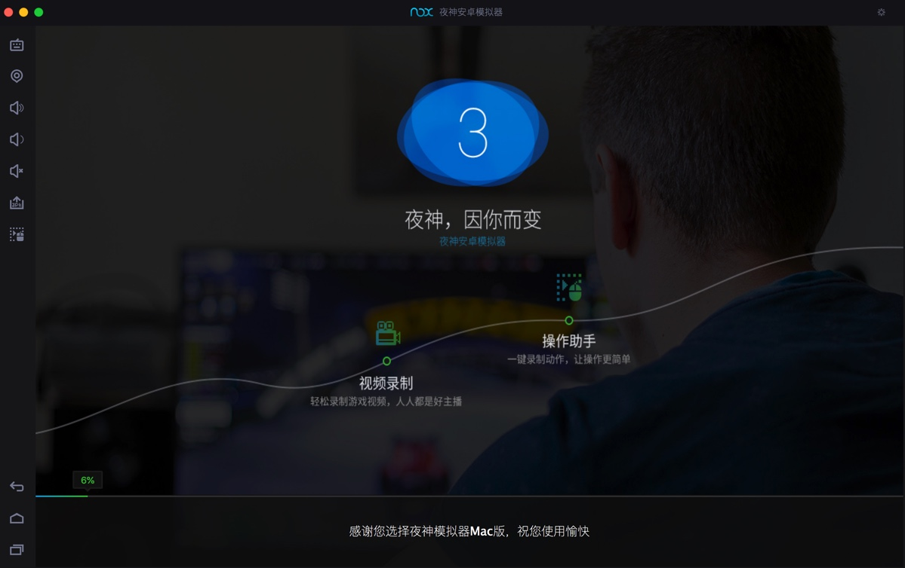
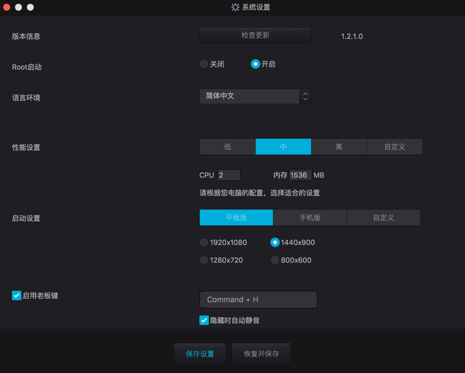
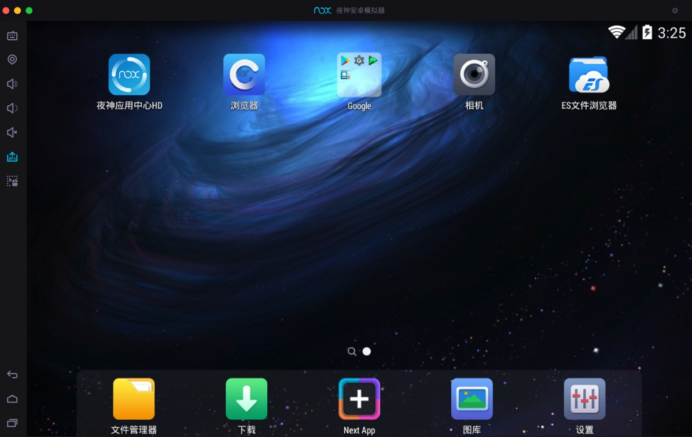
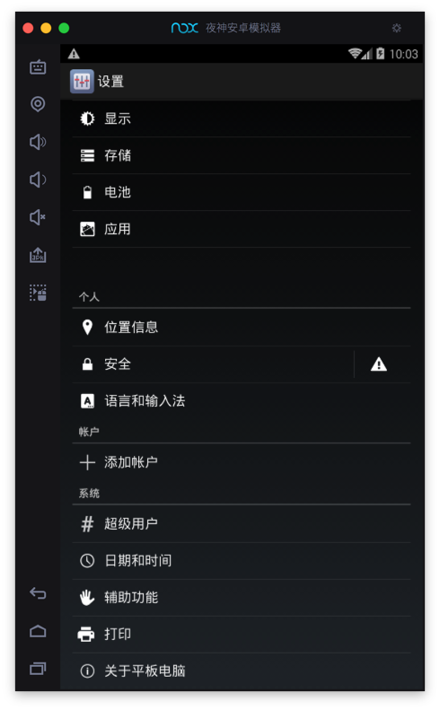
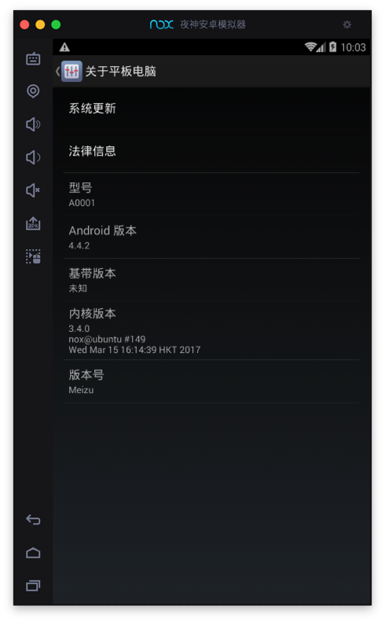
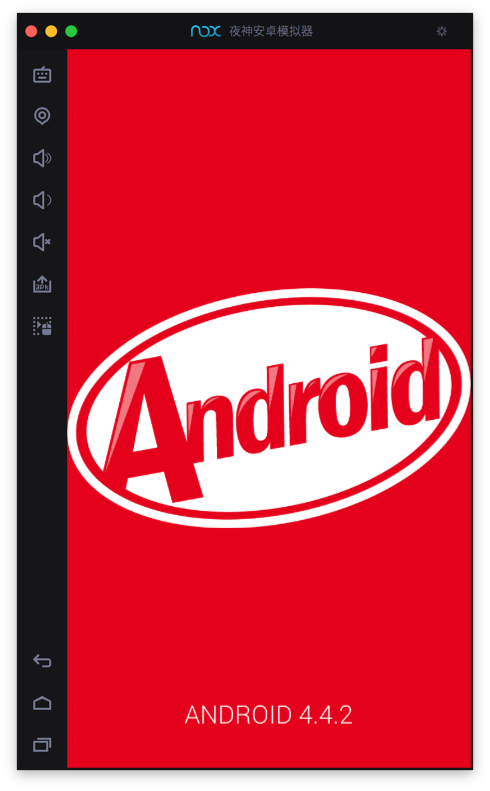

# Mac

从官网

[夜神安卓模拟器-安卓模拟器电脑版下载-官网](https://www.yeshen.com)

下载得到：

* `Nox_installer_for_mac_v1.2.1.0_cn.dmg`
  * http://res.bignox.com/g5/M00/01/83/CqtxtVmdJdyAffQfFzKL72JoiBY391.dmg?filename=Nox_installer_for_mac_v1.2.1.0_cn.dmg

然后去拖动到`应用程序`：

点击`仍要打开`：

即可安装。

启动后：

## 查看Nox的基本信息

看看系统设置页：

桌面：

看看系统版本信息：

模拟的安卓设备：

* 型号：`A0001`
* Android版本：`4.4.2`
* 内核版本：`3.4.0`
* 版本号：`Meizu`

## 最新Nox支持新版Android

截至`20230913`，此处从夜神官网得知，最新版Nox已支持更高版本的Android：

* Windows版：`Android 12`
  * [V7.0.5.8版本更新 | 夜神模拟器帮助中心](https://support.yeshen.com/zh-CN/win-release/7058)
    * V7.0.5.8版本更新
    * 更新时间：2023-6-14
    * 【新增功能】
      * 1、Android12强势来袭！快通过模拟器助手新建体验最新内核！
* Mac版：`Android 7.0`
  * [Mac历史版本信息 | 夜神模拟器帮助中心](https://support.yeshen.com/zh-CN/mac-release/mac-release-history)
    * Mac模拟器版本：V3.0.1.0
    * 更新时间 ：2020-4-14
    * 更新详情：
      * 1.升级Android版本至Android7,游戏兼容性提升
