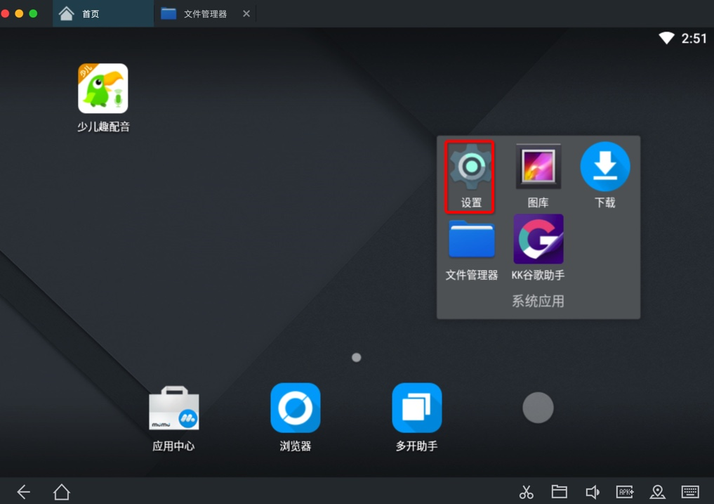

# 夜神Nox概览

* **背景**：

作为安卓相关领域内的工具：**安卓模拟器**

可以有很多用途，比如：

* 配合破解安卓app
* 单独用来运行游戏
  * -> 在（桌面）电脑中打（手机）游戏

市面上很多安卓模拟器：

* [网易Mumu](http://mumu.163.com)
  * 截图
    * 
  * 要么是：运行微信会闪退崩溃
  * 要么是：微信打开小程序会崩溃闪退
  * 无法在VirtualXposed中安装和使用JustTrustMe
* [Andy](https://www.andyroid.net)
  * 无法正常安装
    * 
  * 安装后无法启动
    * 
* [天天](http://www.ttmnq.com)
  * 官网没有mac版
    * 网上能找到mac版
      * 有的也只是2年前很老的版本
        * 而且文件大小也很小，看起来就不太对
          * Mac中无法安装
* [BlueStacks蓝叠](https://www.bluestacks.cn)
  * Mac版（好像）已停止更新
* 其他
  * Genymotion
  * Andy
  * Official Emulator
  * Manymo
  * 等

都不够好用。

后来找到个好用的安卓模拟器：

---

* **夜神Nox**
  * 是什么：一款**安卓模拟器**
  * 全称：`夜神安卓模拟器`
    * `Nox App Player`
  * 资料
    * 官网主页
      * 中文
        * 夜神安卓模拟器-安卓模拟器电脑版下载-官网
          * https://www.yeshen.com
      * 英文
        * Free Android Emulator on PC and Mac - Download NoxPlayer
          * https://www.bignox.com
  * 一句话描述
    * 电脑玩手游的神兵利器
