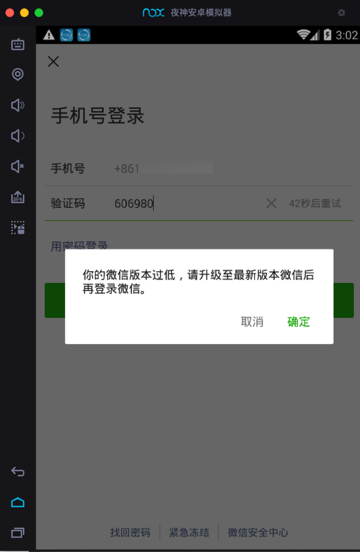

# 无法登录最新版微信

截至20190501 无法运行最新版微信

-》更无法使用小程序了

-》无法配合Charles去抓包微信和微信中的小程序了

详细原因解释：

Mac版 夜神模拟器，此时20190506，官网最新版是：`1.2.5`，只能模拟安卓`4.4.2`

而网上找到了，非官网的，台湾版本的更新的`1.2.6`的夜神

但是安装后，还是模拟安卓`4.4.2`，而不是希望的：`5.1.1`

所以结论是：**无法正常运行微信**

* 最新版微信 `7.0.4`
    * 要求安卓 `4.4.4`以上
* 旧版本微信 `v6.6.7` `v6.7.2`
    * 可以安装，但是无法使用
        * 因为登录登录时会强制升级到最新版才能继续用
