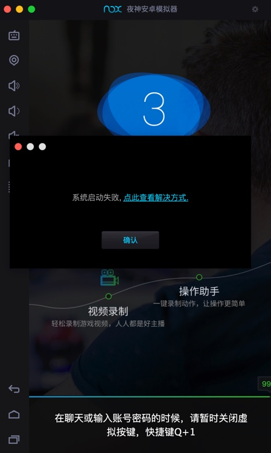
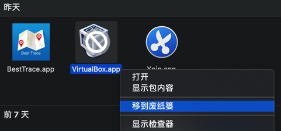
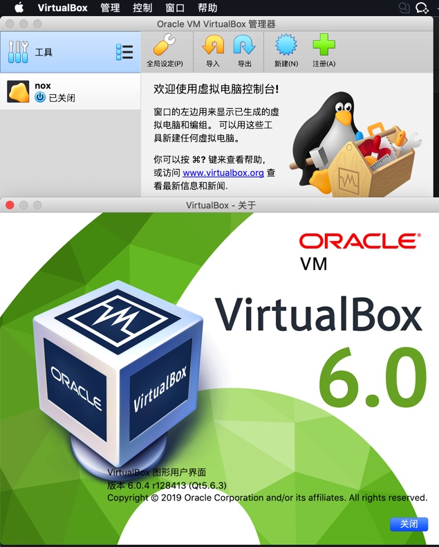
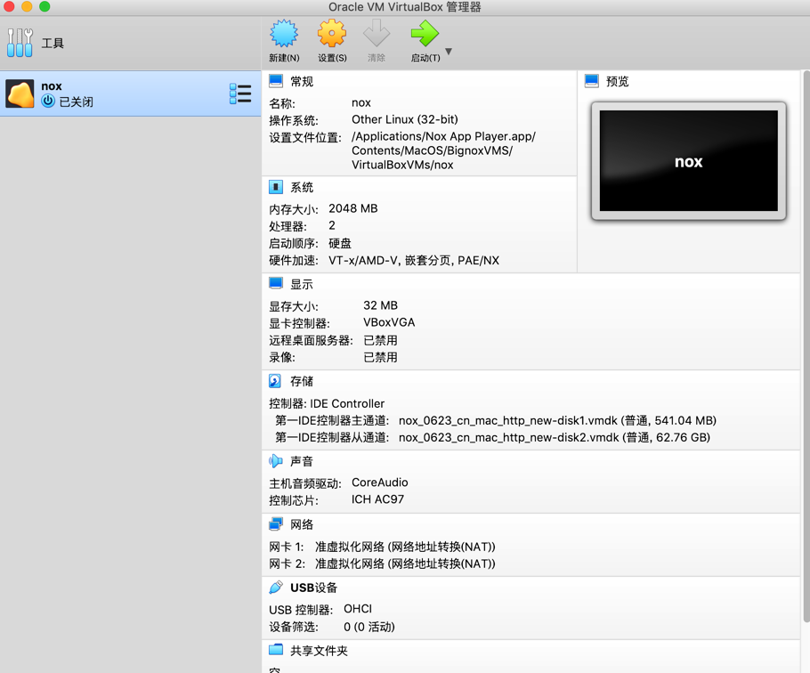
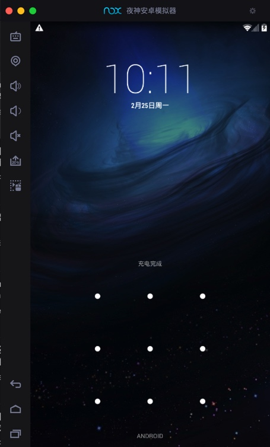

# 偶尔启动卡死在99%

偶尔会到，启动夜神安卓模拟器时，加载到99%，就卡死了：

且弹框提示：

> 系统启动失败，点此查看解决方式

* **原因**：夜神模拟器底层依赖于虚拟机VirtualBox，有时候由于一些未知原因，会导致启动卡死

* **解决办法**：重新安装最新版VirtualBox
* **步骤**

先卸载旧版本VirtualBox：

去官网下载最新版VirtualBox

[Downloads – Oracle VM VirtualBox](https://www.virtualbox.org/wiki/Downloads)

比如此时的：

https://download.virtualbox.org/virtualbox/6.0.4/VirtualBox-6.0.4-128413-OSX.dmg

下载安装后：`VirtualBox 6.0.4`

去重启夜神模拟器（其会自动关闭VirtualBox），即可正常启动：

