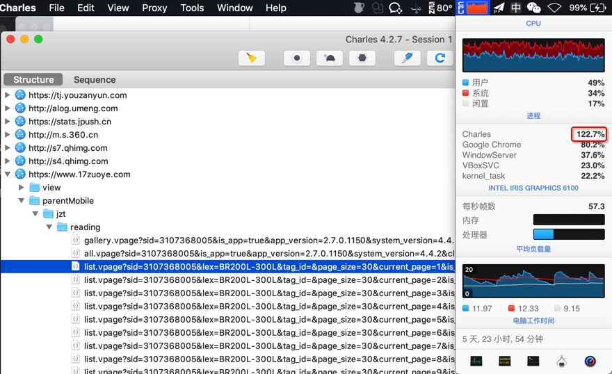

# 有时CPU占用率太高

之前

【或许解决】Mac中Charles抓包安卓模拟器中app时CPU占用率太高

遇到

当Charles抓包安卓模拟器中的app时，CPU占用率急剧升高，非常高，极其的高，高到当前电脑已经卡死了

但是Challenge抓包普通安卓真机时，CPU占用率还行，就没那么高。

后来去升级到最新版Charles，但是问题依旧。

期间也重启过Charles、重启过Nox。

再后来，好像问题又消失了：CPU没那么高了：

总之是，偶尔，有时候，用安卓模拟器，会导致（Charles抓包时），CPU占用率极其高。
