# 设置代理

用Nox配合来给手机app抓包，往往涉及到给Nox配置代理。

比如对于Mac汇总Charles中的代理配置是：

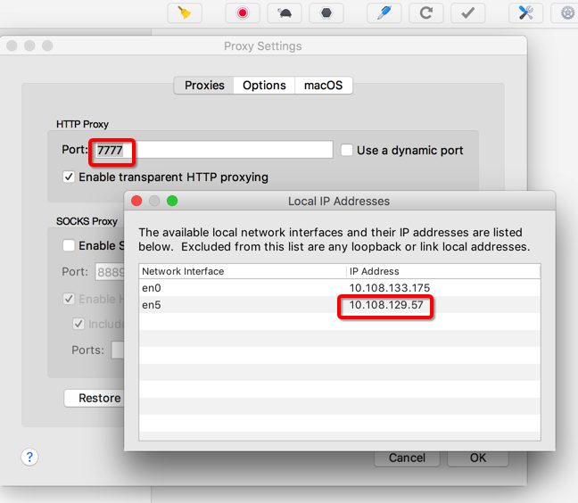

* IP: `10.108.129.57`
* 端口: `7777`

然后去给Nox中WiFi设置此代理配置信息：

先去设置中看看WiFi的配置：

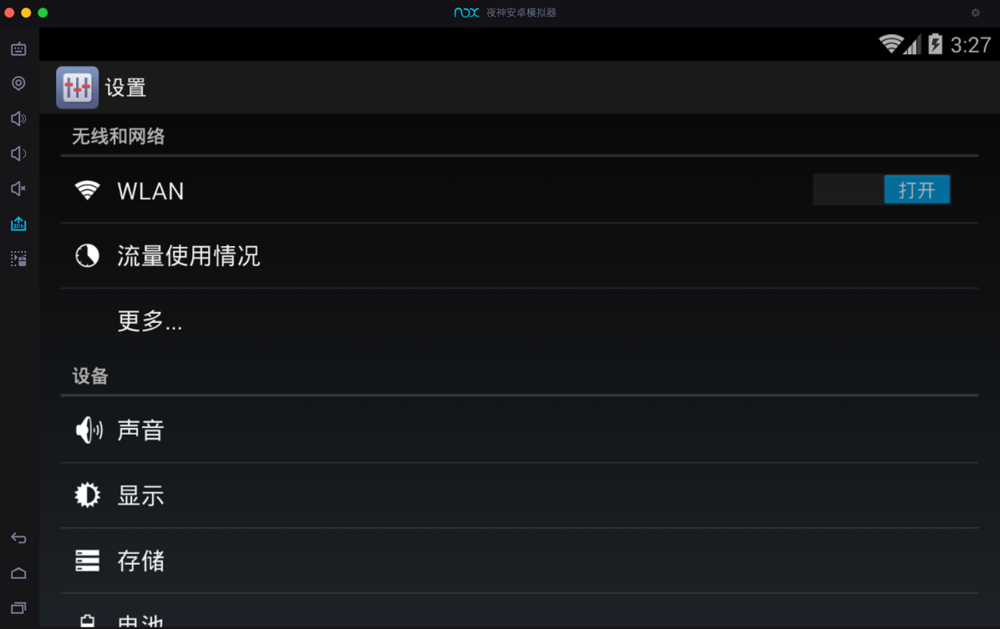

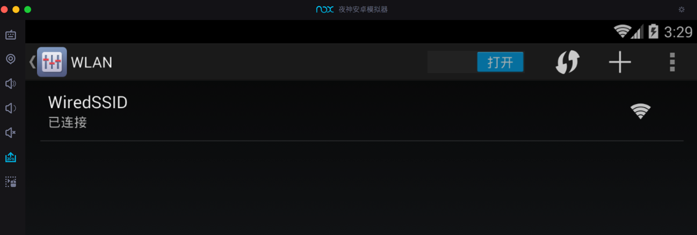

点击后也没有设置代理的地方：

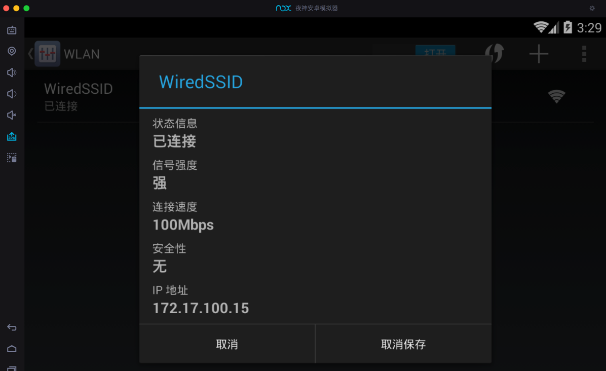

右上角 高级：

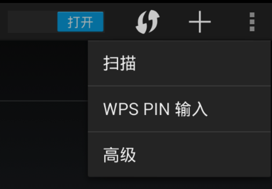

高级WLAN：

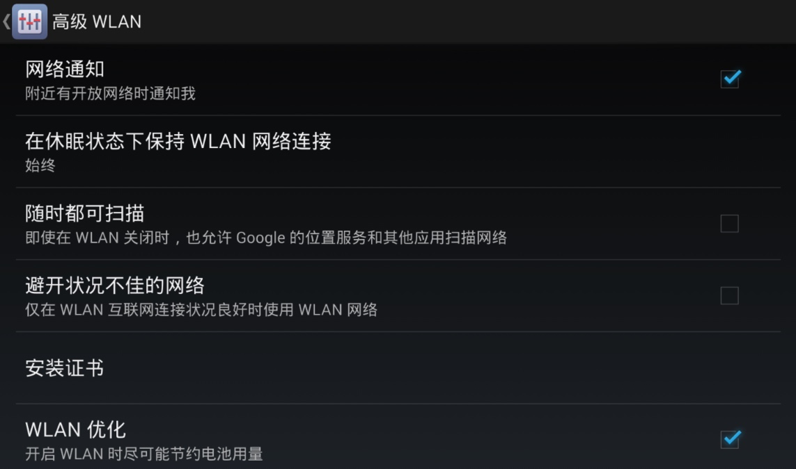

也没有。

后来找到了：

长按`WiredSSD`后，出现弹框，选择`修改网络`：

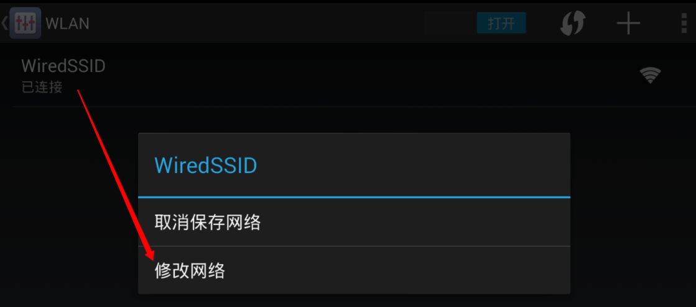

点击`显示高级选项`：

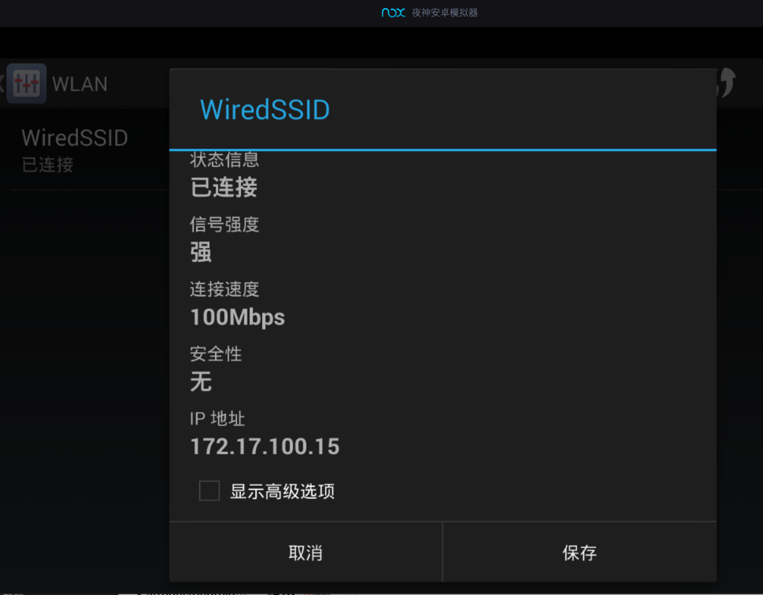

然后就可以设置代理了：

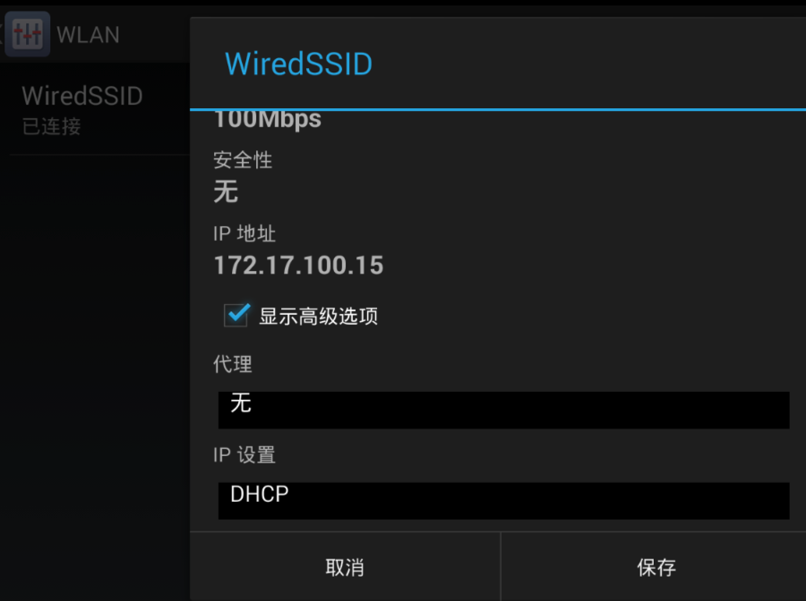

比如，选择`手动`：

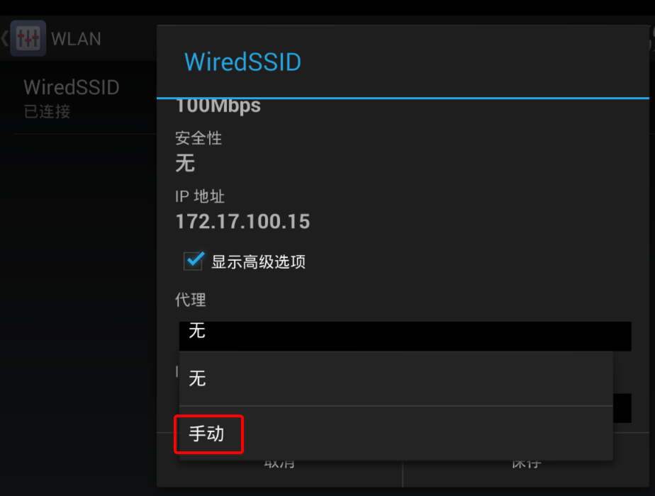

设置代理的IP和端口：

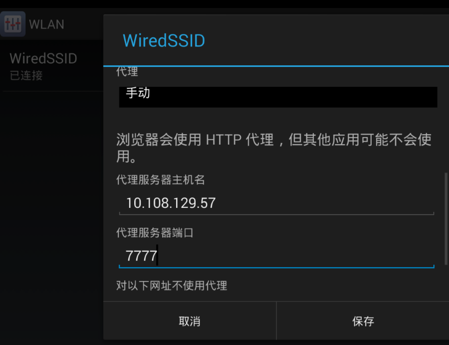

设置完毕后点击`保存`。

注：给WiFi设置了代理后，系统会提示：`网络可能会受到监控 受到不明第三方的 监控`

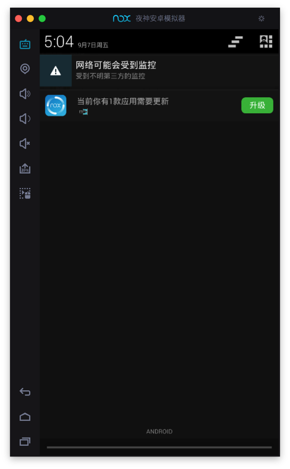

忽略此提示即可。
