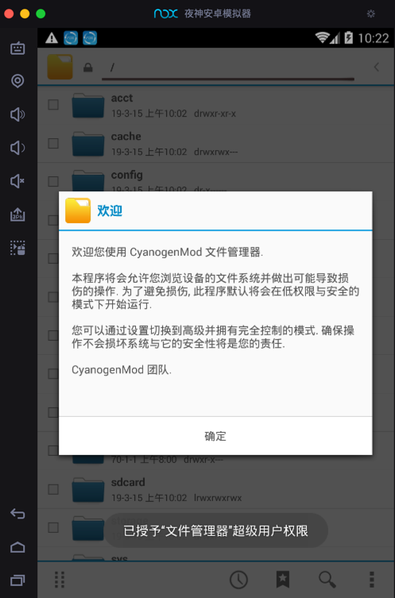
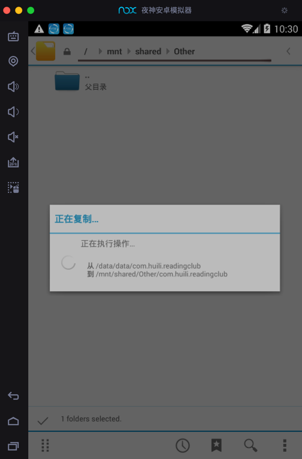
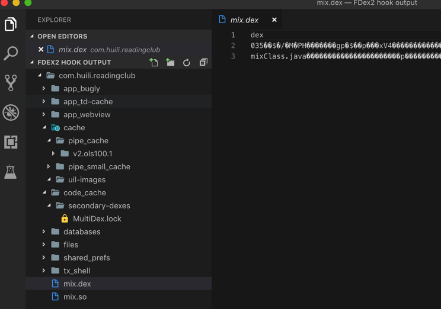

# 导出文件

* **背景**

已经用FDex2去hook导出小花生app的文件到Nox中的：

`/data/data/com.huili.readingclub`

现在想要去导出整个文件夹的所有文件，从Nox导出到Mac电脑中，用于后续分析。

* **思路**：用**文件管理器**把文件拷贝到**共享目录**
  * Nox中（已挂载）的共享目录是：`/mnt/shared/Other`

* **步骤**

去Nox中找到文件管理器

欢迎使用CyanogenMod文件管理器

找到的对应文件夹：`/data/data/com.huili.readingclub`

点击勾选对应目录

然后切换到（此处的Nox和Mac的）共享目录（`/mnt/shared/Other`）后，点击 `粘贴选择项`

则开始执行操作：正在复制...

复制完后，其不会自动刷新。需要点击返回到上一级目录后，再重新点击进来该目录，即可看到复制后的文件：

实现了导出文件的效果，去Mac中打开导出到共享文件夹中的文件：

