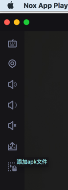
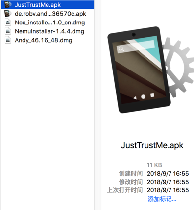
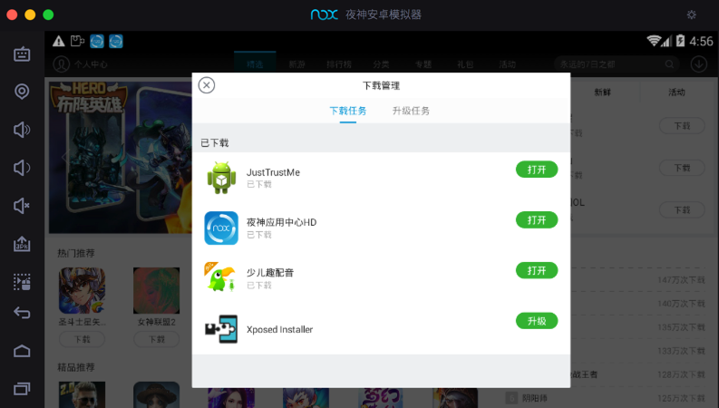
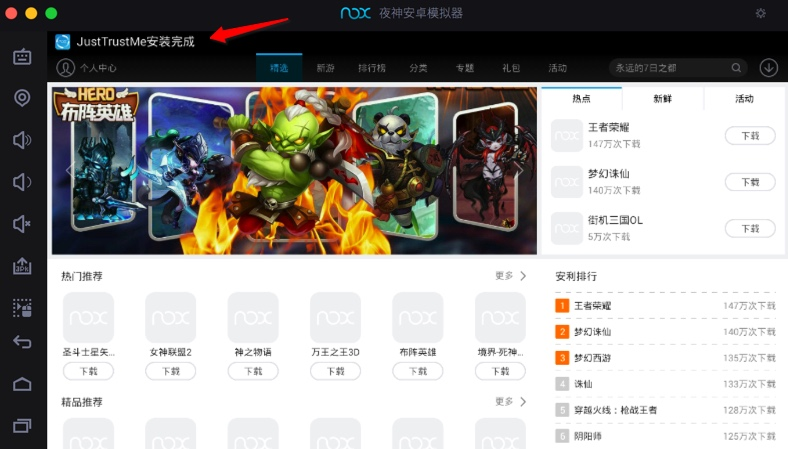
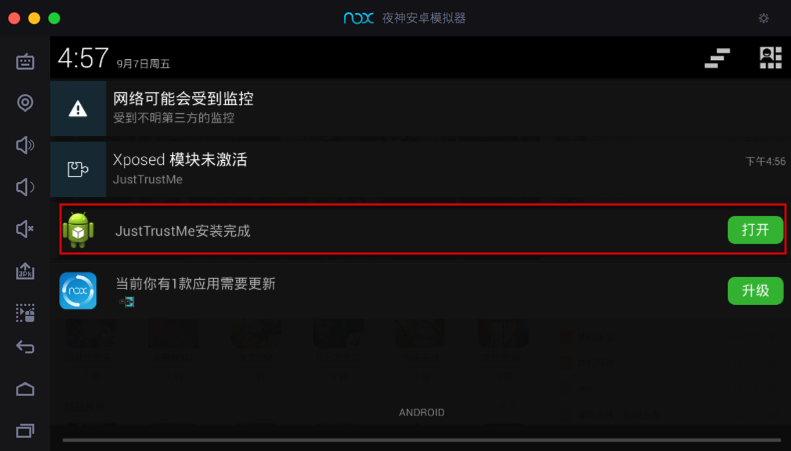
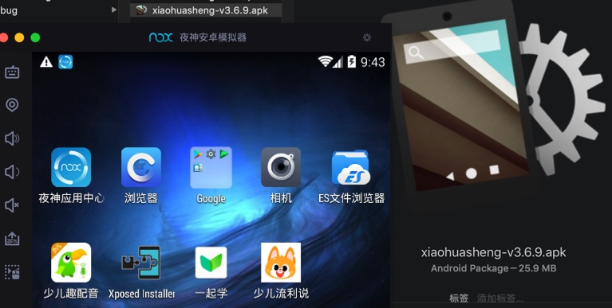

# 安装app

可以从左边栏中点击按钮：`添加apk文件`

然后选择apk，继续去安装。

也可以直接拖动apk到Nox中实现apk的安装。

## 举例：安装JustTrustMe.apk

拖动apk：

进Nox后，自动安装：

提示：`JustTrustMe安装完成`

系统通知中也会提示：`JustTrustMe安装完成`

## 举例：安装小花生的apk

拖动：`xiaohuasheng-v3.6.9.apk`到Nox夜神模拟器中：

即可实现自动安装。
