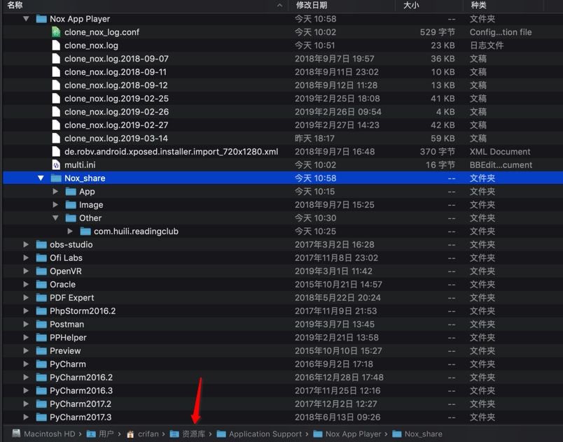

# 共享目录

Nox中自动挂载的共享目录是：`/mnt/shared/Other`

而目录`/mnt/shared/`对应着主机电脑（Win、Mac等）的位置是：

* Windows
  * `C:\Users\%username%\Nox_share\`
* Mac
  * 路径：`/Users/{用户名}/Library/Application Support/Nox App Player/Nox_share`
    * 其中空格需要\转义，转义后：
      * `/Users/{用户名}/Library/Application\ Support/Nox\ App\ Player/Nox_share`
    * 举例
      * `/Users/crifan/Library/Application\ Support/Nox\ App\ Player/Nox_share`
        * 
    * 注
      * 在Mac的Finder中：
        * 英文的目录：`Library`
        * 中文叫做：`资源库`
