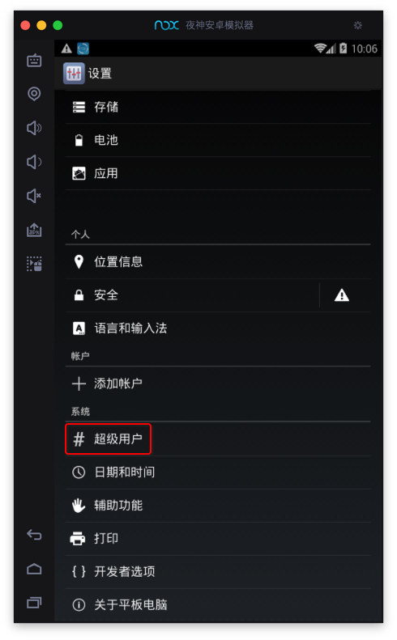
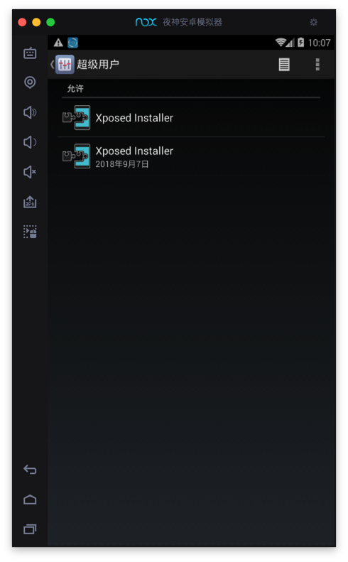
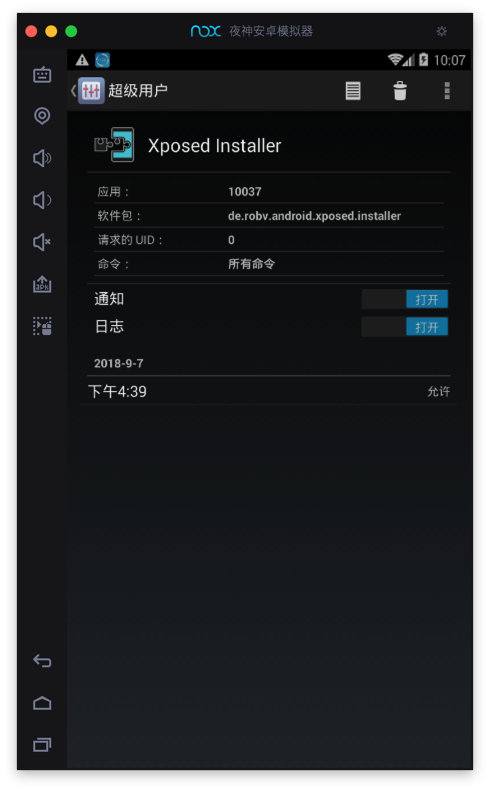
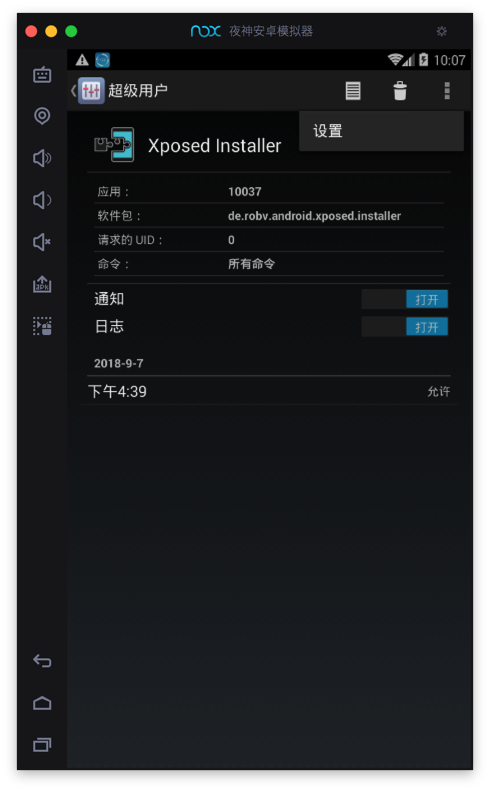
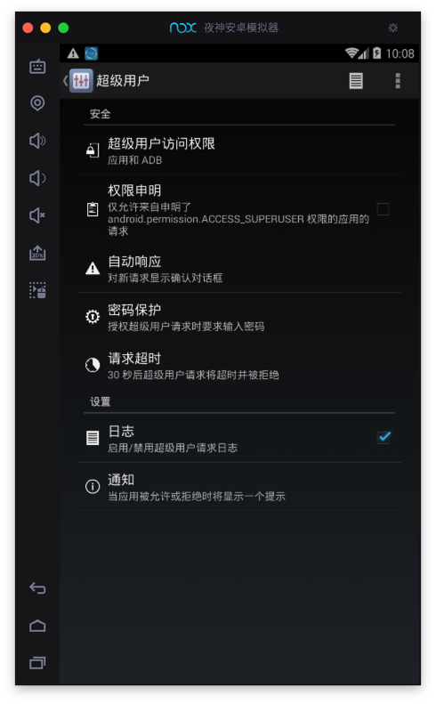

# root超级用户

Nox中自带，或者说很容易，可以开启：`超级用户`=`root`的权限。

比如在后续[安装XPosed框架 · 好用的安卓模拟器：夜神Nox](https://book.crifan.com/books/good_android_emulator_nox/website/usage/mac/install_xposed.html)之后，可以去：

`设置` ->`系统`->`超级用户`->`允许`：

可以看到`Xposed`已经被授予root权限了。

点击进去看看细节：

点击去看看，右上角竖着的三个点的`设置`：

进入`超级用户`的设置页面：

可以根据需要改动相关配置。
