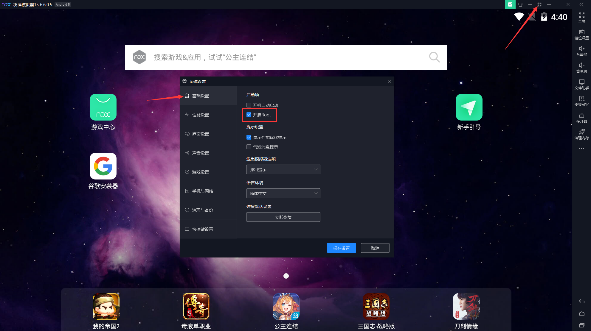

# root超级用户

Nox中自带，或者说很容易，可以开启：`超级用户`=`root`的权限。

在 [安装XPosed框架](../../usage/mac/install_xposed.md) 之后，先去Nox的设置中开启root：

`Nox`->`系统设置`->`基础设置`->`开启root`

再去：

`安卓系统`->`设置` ->`系统`->`超级用户`->`允许`：

可以看到`Xposed`已经被授予root权限了。

点击进去看看细节：

点击去看看，右上角竖着的三个点的`设置`：

进入`超级用户`的设置页面：

可以根据需要改动相关配置。
