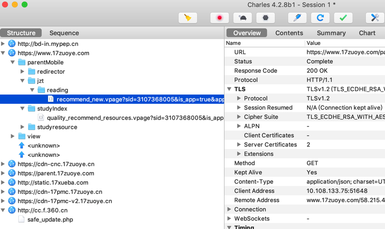
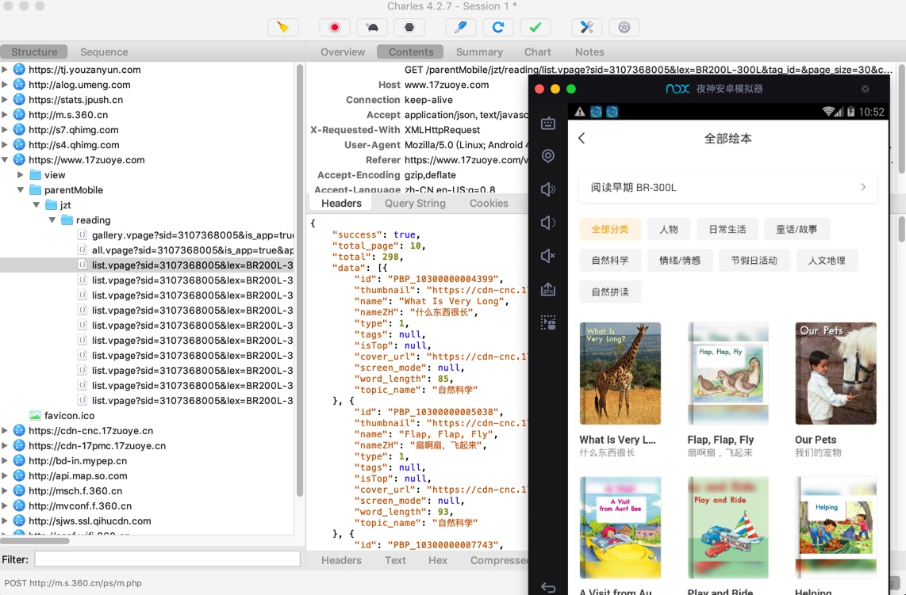

# 能抓到真机无法抓的包

对于用安卓手机去抓包，有时候特殊情况下，部分APP，在真机中无法抓包，比如：

【已解决】Charles抓不到某些http的请求数据包

中的，无法抓到：jzt的reading下面的list的请求

同一个安卓apk，换用安卓模拟器：Nox夜神安卓手机模拟器：

【已解决】用安卓模拟器看能否解决Charles丢失部分抓包的问题

即可抓到包，能抓到：jzt的reading的list

