# 安装Charles证书

## Nox安装Charles证书

Nox安卓模拟器中：

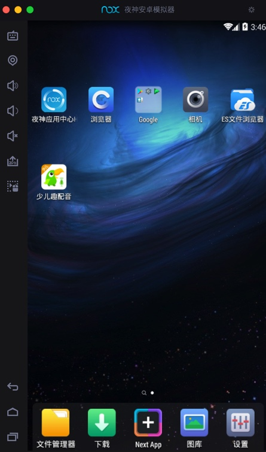

用浏览器打开：

http://chls.pro/ssl

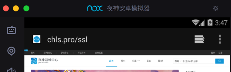

效率真高：都没有下载证书文件，再打开证书文件的步骤，直接弹出安装证书界面：

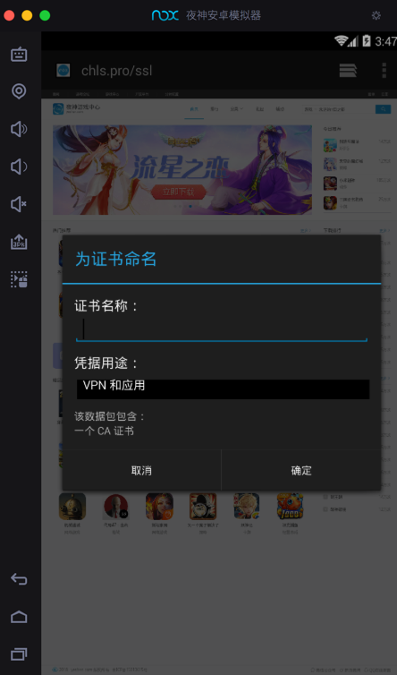

然后输入 证书名称 选择 `凭据用户` 为默认的 `VPN和应用`：

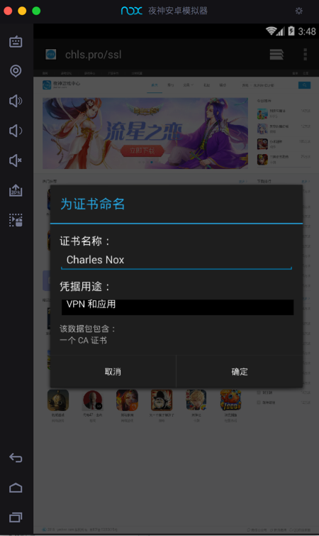

即可，提示已安装证书：

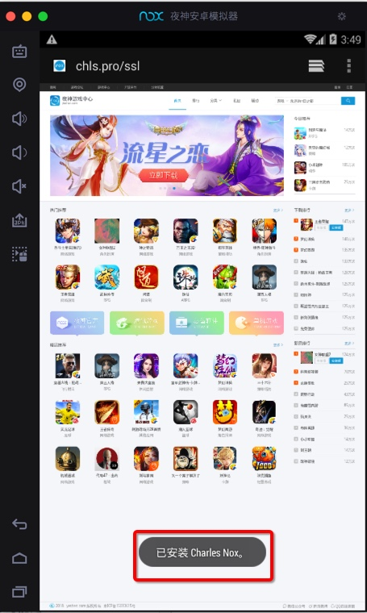

## 注意：要开启锁屏PIN或密码才可以

如果本身Nox没有设置屏幕密码，则会弹框提示：

> 您需要先设置锁定屏幕PIN或密码才能使用凭据存储

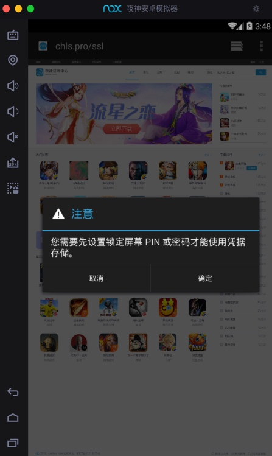

点击 确定 后，进入 解锁方式选择：

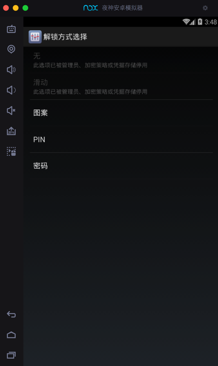

此处选择了图案解锁：

选择您的图案

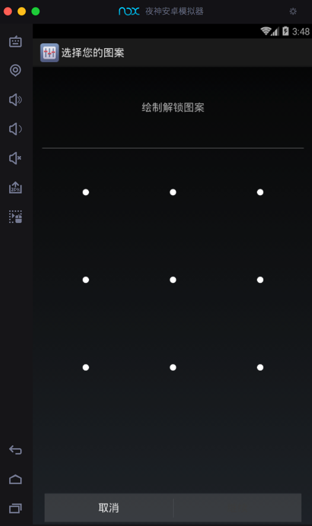

图案已记录

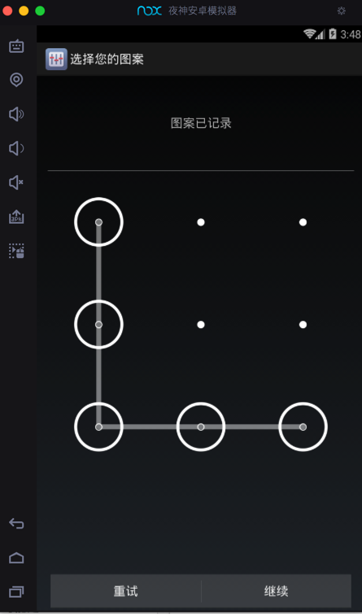

您的新解锁图案

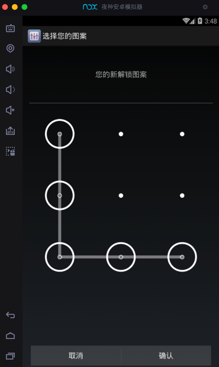

## 安装证书后确认已安装

去设置中确认是否已经安装到系统了：

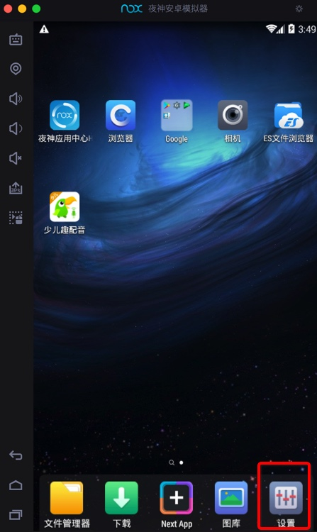

`设置`->`安全`

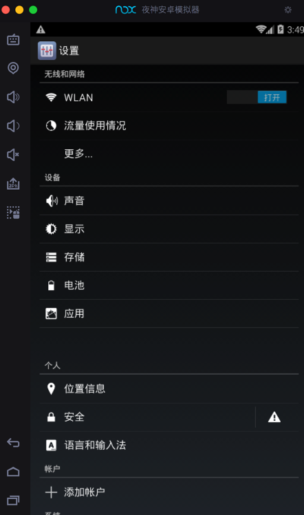

`安全` -> `受信任的凭据`

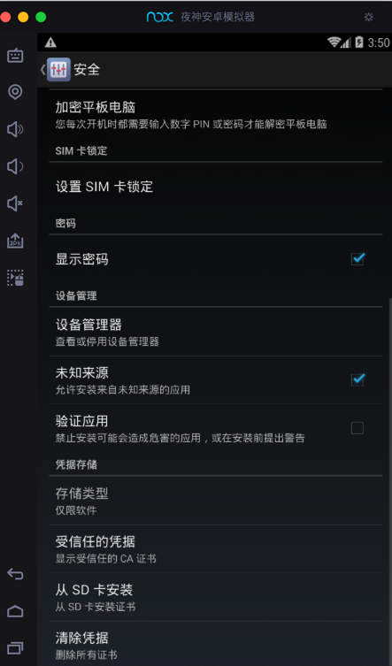

系统中没有Charles：

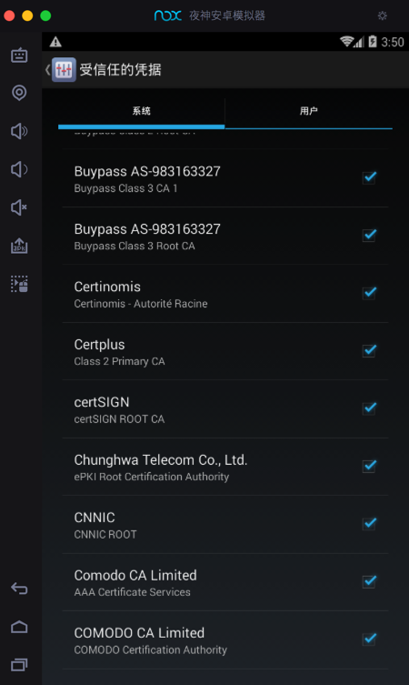

`用户`中有：`Charles`

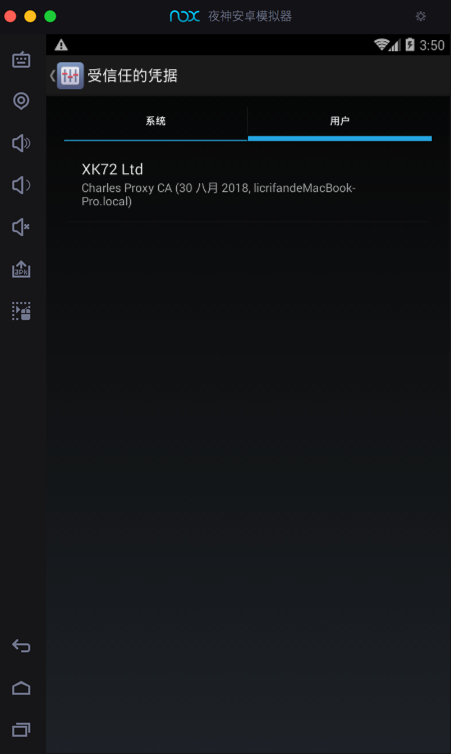

点击查看详情：

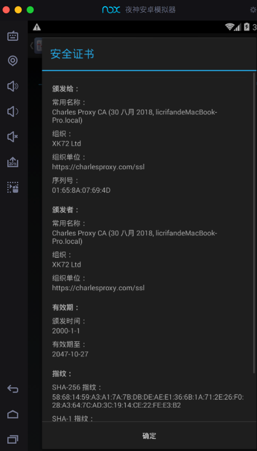
