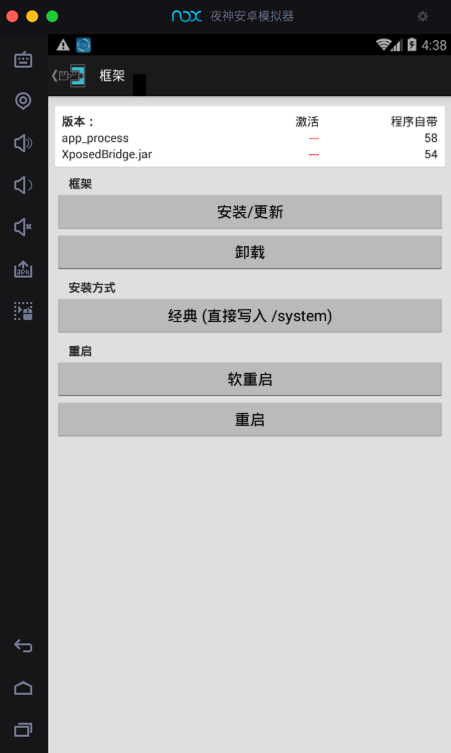
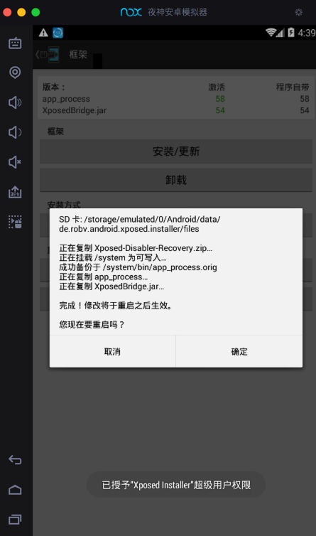
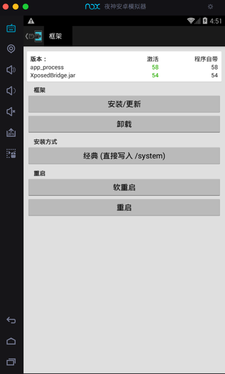
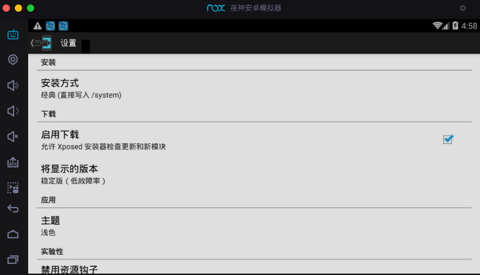
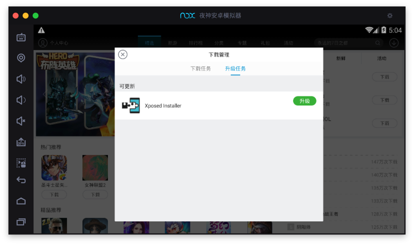

# 安装XPosed框架

此处介绍Mac中在夜神Nox中安装[XPosed框架](https://book.crifan.com/books/crack_assistant_xposed_framework/website/)

此处Nox的Android版本是：`4.4.2`

需要去安装版本匹配的：

* `2.7 experimental1`的`Xposed Installer`
  * 适用于：`Android 4.0.3` ~ `Android 4.4`
  * 安装包：[de.robv.android.xposed.installer_v33_36570c.apk](https://dl-xda.xposed.info/modules/de.robv.android.xposed.installer_v33_36570c.apk)
    * 来源网站
      * [Xposed Installer | Xposed Module Repository](https://repo.xposed.info/module/de.robv.android.xposed.installer)
    * 作者
      * [rovo89](https://repo.xposed.info/users/rovo89), [Tungstwenty](https://repo.xposed.info/users/tungstwenty)
    * 下载后
      * 

然后点击左下角的：`添加apk文件`

会自动打开应用管理器，显示：`安装中`

安装后会在桌面中看到：`Xposed Installer`

点击打开：

点击框架

提示你可能会变砖

点击确定，弹框消失：

点击：`安装/更新`

弹框：超级用户请求，选择：`永久记住选择`，点击`允许`

提示：已授予Xposed Installer超级用户权限

弹框确认是否要重启，点击 确定：

然后Nox重启：

重启完毕：

点击再次进去Xposed：

再次重启后，进入框架：

可以看到框架中显示：

* app_process 激活 58 程序自带 58
* XposedBridge.jar  激活 54 程序自带 54

其中已安装了：`2.7 experimental1`的`Xposed Installer`

## XPosed相关页面

顺带看看其他页面：

设置：

日志：

关于：

## 心得：不要安装版本不匹配的XPosed

此处Nox的Android版本是：`4.4.2`

所以只能安装对应的`2.7`的XPosed

如果不小心安装了`3.1.5`的XPosed，其只支持`Android 5.1`：

（此处可以从Nox的应用商店中搜到这个）

安装后是：`3.1.5`的`Xposed Installer`

则：和此处`Android 4.4.2`的Nox是不匹配的，导致后续无法正常使用。

### 注意：不要轻易升级到新版XPosed

类似的：

当看到系统有提示新版XPosed：

此处不要去升级，否则升级到新版`Xposed 5.1.1`后，就和此处的`Android 4.4.2`的Nox不兼容了，无法继续使用了。

## 心得：遇到键盘无法输入时，记得再重启一次Nox

在Nox中安装Xposed之后，如果遇到键盘无法输入，则：再多重启一次Nox，即可解决：

> 安装4.42安卓版本XP框架首次重启模拟器会导致：无法使用物理键盘（不能打字）的情况，再重启一次模拟器即可
