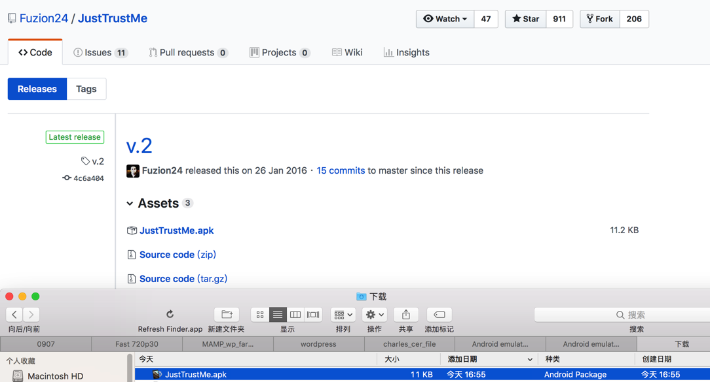
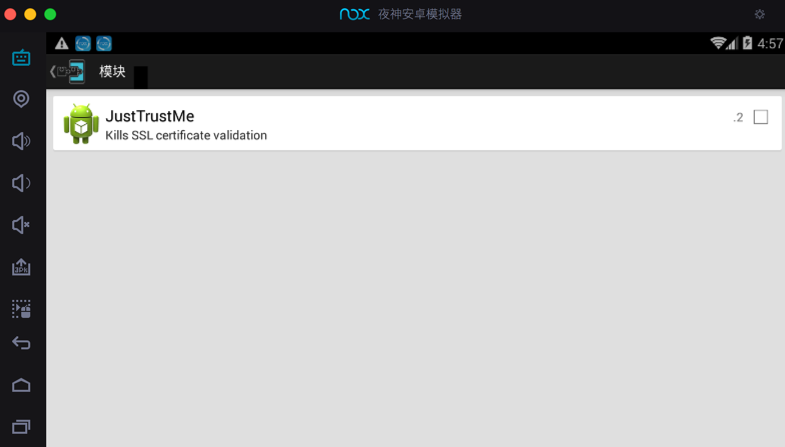
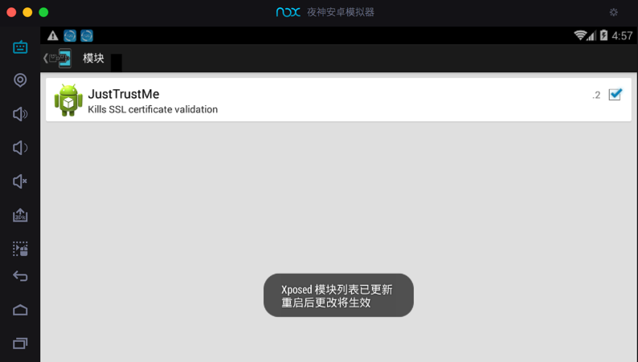
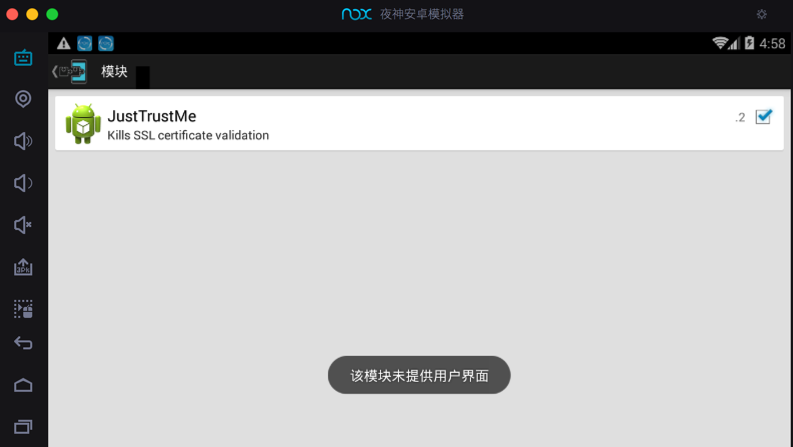
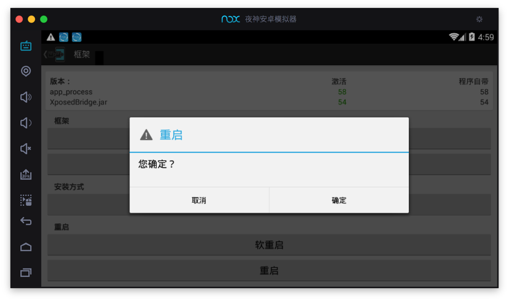
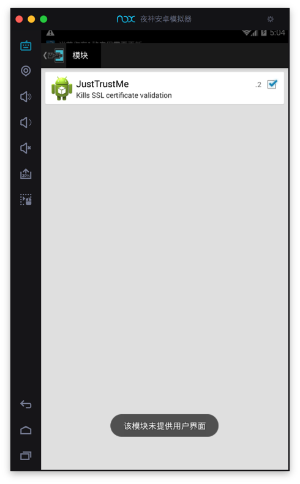

# XPosed中安装JustTrustMe

去

https://github.com/Fuzion24/JustTrustMe

->

https://github.com/Fuzion24/JustTrustMe/releases/tag/v.2

下载得到：

* `JustTrustMe.apk`
  * 

然后安装到Nox中。

具体过程详见：[安装app · 好用的安卓模拟器：夜神Nox](https://book.crifan.org/books/good_android_emulator_nox/website/usage/common/install_app.html)

进入Xposed中的模块，可以看到：`JustTrustMe`

点击勾选，以激活：

另外，想要点击进去查看详情，结果没有详情页：`该模块未提供用户界面`

然后记得去XPosed中重启：

重启后，确认`JustTrustMe`的确已激活：显示已勾选☑️

