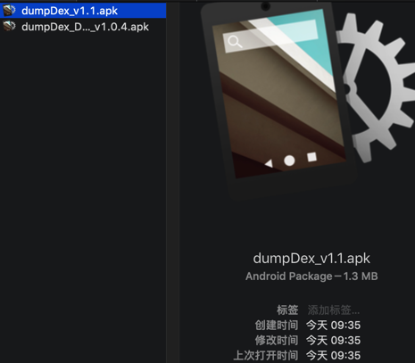
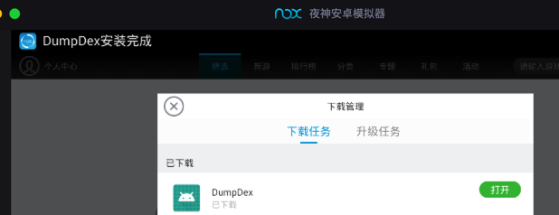
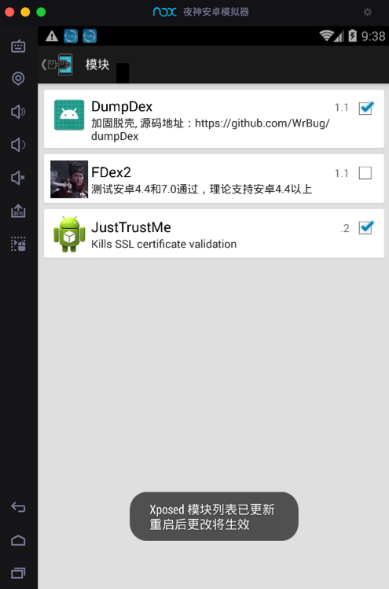
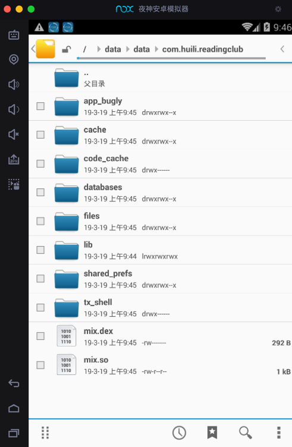

# 配合XPosed插件导出dex

此处介绍用Nox配合XPosed的插件，去导出安卓apk的dex文件。

## dumpDex

用Nox配合XPosed插件：[dumpDex](https://github.com/WrBug/dumpDex)，去导出dex文件。

先去从[这里](https://github.com/WrBug/dumpDex/releases)下载到[dumpDex apk](https://github.com/WrBug/dumpDex/releases/download/v1.1/app-release.apk)文件

然后安装到夜神模拟器中：

安装后：

* 注意：dumpDex是没有界面的
  * 桌面上是没有图标的
* 但可以在XPosed框架中的模块中找到：
  * 

然后重启XPosed。

然后在安装了要处理的安卓apk（比如`xiaohuasheng-v3.6.9.apk`）后，再去运行，即可导出对应的dex文件。

可以在文件浏览器中对应目录：

`/data/data/com.huili.readingclub`

中找到导出的dex文件：

注：此处只有一个极小的292B的`min.dex`，是不正常的。但是其他普通的apk，是可以导出大小正常的，很多MB的dex文件的。

## FDex2

详见：

[FDex2 · Android逆向：静态分析](https://book.crifan.org/books/android_re_static_analysis/website/by_file_type/for_dex/crack_export_dex/crack_tool/fdex2/)
